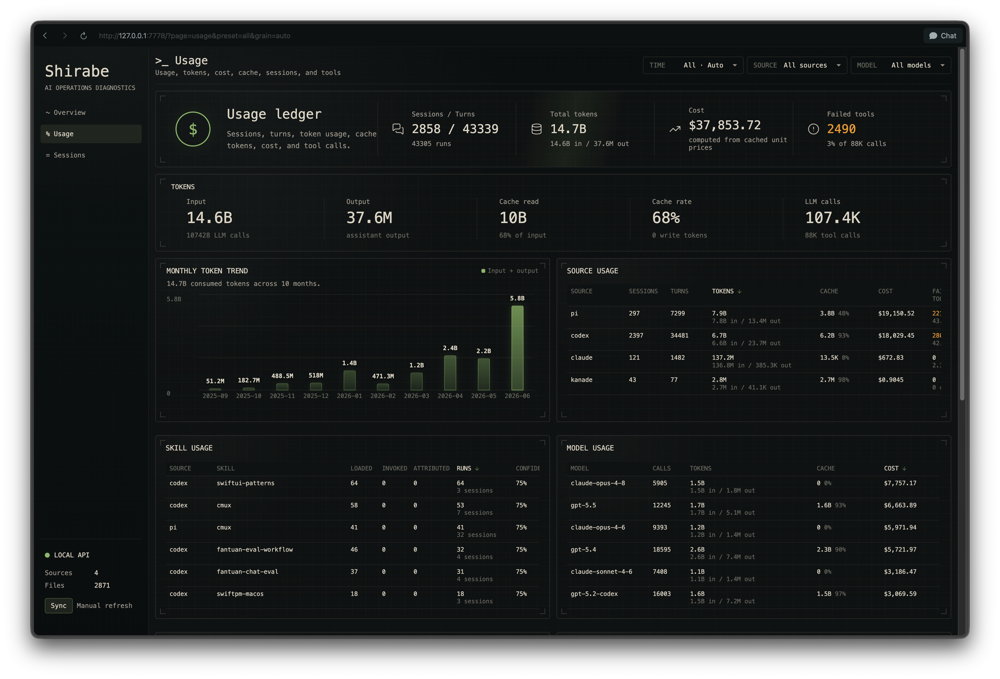
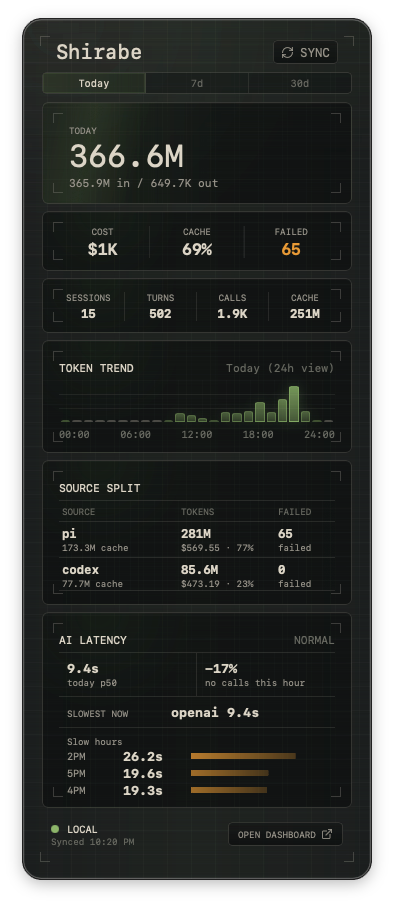

# Shirabe

Local-first usage and tracing console for personal AI coding workflows.

Shirabe imports local agent logs into SQLite, normalizes them into common
operation records, computes usage rollups, and exposes both a full web dashboard
and a compact macOS menu bar view.

## Screenshots

| Usage Dashboard | macOS Menu Bar |
| --- | --- |
| <a href="script/usage.png"></a> | <a href="script/menubar.png"></a> |

## Surfaces

Shirabe has two UI surfaces over the same local API and database:

- Web dashboard: full usage, sessions, run detail, and trace workspace.
- macOS menu bar: compact usage monitor for daily token, cost, cache, source,
  and recent run checks.

They are independent views. You can use the browser dashboard without the menu
bar app, or run only the menu bar app while the local Shirabe server is running.

## Current Support

| Source | Status | Notes |
| --- | --- | --- |
| Codex | Supported | Sessions, runs, turns, token usage, cache, tools, skills, and trace detail from local Codex data. |
| pi | Supported | Sessions, runs, token usage, cache, tools, failures, skills, and trace detail from local pi data. |
| Claude Code | Supported | Local usage/session import and cost estimation from Claude logs. |
| Kanade | Supported | Workflow/task import, spans, token usage, model/tool summaries, and trace detail where Kanade data provides it. |
| Tsutae | Not integrated | Planned, not connected yet. |

Cost is estimated from cached model unit prices. Cache hit, tool failure, and
trace quality depend on what each source records locally.

## Quick Start

Prerequisites:

- Rust stable
- Node.js 22+
- macOS and SwiftPM for the menu bar app
- `just` for the command shortcuts

Initialize the local database:

```bash
just init
```

Import local data:

```bash
just import-codex
just import-pi
just import-claude
just import-kanade
```

Or import everything and refresh rollups:

```bash
just import-all
```

Refresh model pricing:

```bash
just pricing
```

Start the local server and web dashboard:

```bash
just restart
```

Then open:

```text
http://127.0.0.1:7778
```

Run the macOS menu bar shell:

```bash
just macos-run
```

The menu bar app expects the local server at `http://127.0.0.1:7778`. If the
popover shows offline, run `just restart`.

## Beta Distribution

GitHub beta releases ship two artifacts:

- `shirabe-v<version>-<target>.tar.gz`: CLI/server plus the built web UI.
- `ShirabeBar-v<version>-<target>.dmg`: macOS menu bar app with the server and UI bundled.

Build both locally:

```bash
just package
```

Use the CLI package without the menu bar app:

```bash
tar -xzf shirabe-v<version>-aarch64-apple-darwin.tar.gz
cd shirabe-v<version>-aarch64-apple-darwin
./bin/shirabe init
./bin/shirabe serve --ui-dir ./ui/dist
```

Use the macOS menu bar package by opening the DMG and dragging
`ShirabeBar.app` into Applications. The app starts its bundled Shirabe server
when no server is already running on `127.0.0.1:7778`.

Unsigned beta builds may show a macOS warning that the developer cannot be
verified. Open the app with Control-click, then Open. For wider distribution,
set `SIGN_IDENTITY` and notarize with Apple Developer ID:

```bash
SIGN_IDENTITY="Developer ID Application: Example (TEAMID)" \
NOTARIZE=1 \
NOTARY_PROFILE=shirabe-notary \
just package-macos
```

## Development

Useful commands:

```bash
just build
just test
just ui-build
just macos-build
just check
```

CI runs:

- `cargo fmt --all -- --check`
- `cargo clippy --all-targets --all-features -- -D warnings -A clippy::too_many_arguments`
- `cargo test --all-targets --all-features`
- `npm ci && npm run build` in `ui/`
- `swift build --package-path app/macos/ShirabeBar`

## Layout

```text
src/
  importers/      local source parsers
  projection/     normalized operation model
  skills/         skill usage extraction
  server.rs       local API and static UI server
  rollup.rs       usage rollup generation

ui/
  src/            Svelte dashboard and menu bar web views

app/macos/
  ShirabeBar/     native macOS menu bar shell

script/
  build_and_run.sh
  usage.png
  menubar.png
```

## Data

By default Shirabe stores local data under its configured data directory. You can
override it with:

```bash
SHIRABE_DIR=/path/to/data cargo run -- init
```

Importer source paths default to local agent data under your home directory:

- Codex: `~/.codex/sessions`
- pi: `~/.pi/agent/sessions`
- Claude Code: `~/.claude/projects`
- Kanade: `~/.kanade/traces`

Override a one-off import with `--path`:

```bash
shirabe import codex --path /path/to/codex/sessions
```

For the server and menu bar app, configure source paths in
`$SHIRABE_DIR/config.json`:

```json
{
  "sources": {
    "codex": "~/Library/Application Support/Codex/sessions",
    "pi": "~/.pi/agent/sessions",
    "claude": "~/.claude/projects",
    "kanade": "~/.kanade/traces"
  }
}
```

Environment variables are also supported. Exact session/project paths take
precedence over root directories:

```bash
SHIRABE_CODEX_SESSIONS_DIR=/path/to/sessions
SHIRABE_PI_DIR=/path/to/.pi
SHIRABE_CLAUDE_DIR=/path/to/.claude
SHIRABE_KANADE_DIR=/path/to/.kanade
```

The project is local-only today. It does not upload agent logs or usage data.

## License

MIT. See [LICENSE](LICENSE).
